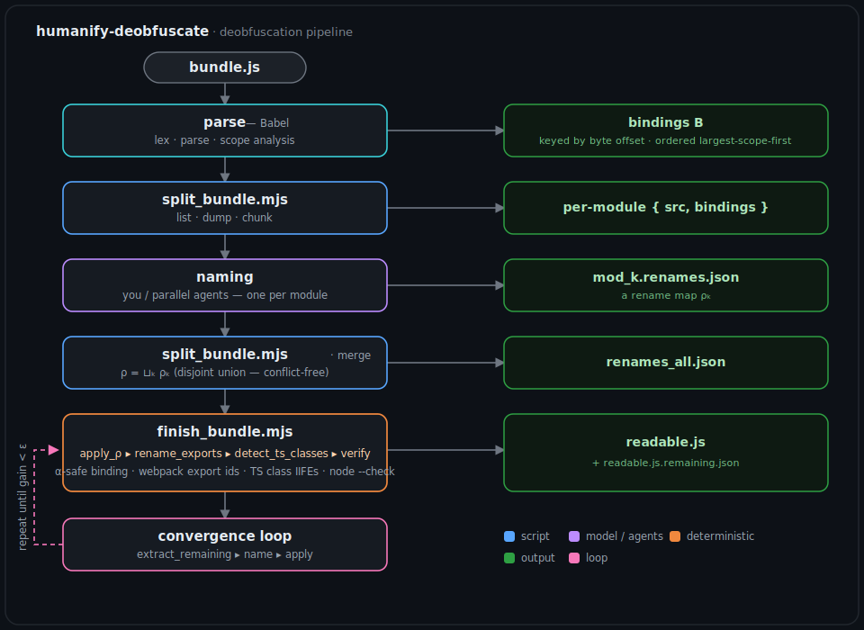

# humanify-deobfuscate

[](https://github.com/ajsb85/humanify-deobfuscate/actions/workflows/ci.yml)
[](https://github.com/ajsb85/humanify-deobfuscate/releases)
[](LICENSE)

A [Claude Code](https://claude.com/claude-code) **agent skill** that makes minified,
bundled, or obfuscated JavaScript readable again — by renaming identifiers **scope-safely
with an AST while the model supplies the names**. It reaches the parts plain renaming
can't: webpack export-ids (`.a`/`.b`) and TypeScript class-IIFE constructors, with a
deterministic backbone and a convergence loop for large bundles.

It's the from-scratch reimplementation of [humanify](https://github.com/jehna/humanify)'s
technique: a script owns *correctness* (Babel `scope.rename`), the model owns *naming*.

## Why this exists

Renaming minified JS by hand or with find-and-replace silently corrupts code — shadowed
variables merge, names collide. This skill routes every rename through an AST so it's
always safe, and it has been run end-to-end on a real **1 MB / 124-module / ~10k-identifier
webpack bundle**, cutting single-letter identifier tokens by ~63% while keeping the output
byte-for-byte behavior-equivalent.

## Install

Requires [Node.js](https://nodejs.org/). Install with the [skills CLI](https://skills.sh):

```bash
npx skills add ajsb85/humanify-deobfuscate -g
```

Or clone manually into your agent's skills directory (`~/.claude/skills/` for Claude Code),
then install the Babel dependencies:

```bash
cd humanify-deobfuscate/scripts && npm install
```

## Use it

Just ask your agent in natural language — the skill triggers on minified `.js`,
"deobfuscate", "un-minify", "make this readable", "what does this minified code do", etc.
For example:

> "Deobfuscate `vendor.min.js` and tell me what the `parseConfig` module does."

### Single file

```bash
node scripts/extract_identifiers.mjs input.js > identifiers.json   # AST → bindings + context
# (the model names them into renames.json keyed by byte offset)
node scripts/apply_renames.mjs input.js renames.json readable.js   # scope-safe rename
node --check readable.js
```

### Webpack / browserify bundles

```bash
node scripts/split_bundle.mjs bundle.js list                       # survey modules
node scripts/split_bundle.mjs bundle.js dump work 73 102           # dump per module
# (one agent per module names its bindings -> work/mod_<idx>.renames.json)
node scripts/split_bundle.mjs bundle.js merge work renames_all.json
node scripts/finish_bundle.mjs bundle.js renames_all.json readable.js   # deterministic backbone
```

See [`SKILL.md`](SKILL.md) for the full workflow, including the parallel-agent scaling
pattern and the convergence loop.

## What's inside

| Script | Role |
|---|---|
| `extract_identifiers.mjs` | AST → renameable bindings + context, keyed by byte offset |
| `apply_renames.mjs` | scope-safe rename (`scope.rename`) + codegen |
| `split_bundle.mjs` | bundle mode: `list` / `dump` / `chunk` / `merge` |
| `rename_exports.mjs` | post-pass: webpack export-ids (`.a`/`.b` → real names) |
| `detect_ts_classes.mjs` | post-pass: TS class-IIFE inner ctors + super params |
| `extract_remaining.mjs` | convergence loop: surface remaining nameable bindings |
| `finish_bundle.mjs` / `.sh` | one-command deterministic backbone |

## How it works

The model never edits code — it only suggests one name at a time, and an AST applies it
across the binding's whole scope. The rest of this document is the full theory,
architecture, and runbooks. See also [`references/algorithm.md`](references/algorithm.md)
and [`references/agent-prompt.md`](references/agent-prompt.md).

---

## Architecture

<p align="center">
  
</p>

<details>
<summary>Text version of the pipeline</summary>

```
 bundle.js ──▶ parse (Babel) ──▶ AST T + scope tree ──▶ bindings B  (keyed by byte offset)
                                                              │
        ┌─────────────────────────────────────────────────────┘
        ▼
 split_bundle.mjs   list · dump · chunk          ──▶  per-module { src, bindings }
        │
        ▼
 naming (you / parallel agents)                   ──▶  mod_k.renames.json   (a map ρ_k)
        │
        ▼
 split_bundle.mjs merge      ρ = ⨆ₖ ρ_k           ──▶  renames_all.json
        │
        ▼
 finish_bundle.mjs   apply_ρ ▸ rename_exports ▸ detect_ts_classes ▸ verify
        │                    (α-safe binding)  (export ids)  (class IIFEs)
        ▼
 readable.js   +   readable.js.remaining.json
        │
        ▼
 convergence loop   extract_remaining ▸ name ▸ apply      (repeat until gain < ε)
```

</details>

The design separates **correctness** (owned by deterministic AST scripts) from **naming
judgment** (owned by the model). Everything below makes that split precise.

## Theory: deobfuscation as α-conversion

Let a source program be a string $P$. Parsing yields an abstract syntax tree $T$ and,
via scope analysis, a finite set of **bindings** $B=\{b_1,\dots,b_n\}$. Each binding $b$
carries a declaration offset $\text{pos}(b)\in\mathbb{N}$ (unique), a scope $\sigma(b)$, a
set of reference sites $R(b)$, and a current name $\text{name}(b)\in\Sigma^*$.

A **rename map** is a partial function keyed by offset,

$$ \rho:\ \mathbb{N}\ \rightharpoonup\ \Sigma^*, $$

where $\rho(\text{pos}(b))$ is the new name of $b$ (undefined ⇒ unchanged). Applying $\rho$
produces $P'$. The soundness guarantee is **α-equivalence**:

$$ P'\ \equiv_\alpha\ P \quad\Longrightarrow\quad \llbracket P'\rrbracket=\llbracket P\rrbracket, $$

i.e. the program is identical up to consistent renaming of bound identifiers, so its
observable behavior is unchanged. This holds because each binding is renamed *together
with its whole reference set* $R(b)$ inside $\sigma(b)$, and capture is avoided (below).

**Why text replacement is unsound.** A naive substitution $\text{sub}(P,a,a')$ replaces
every textual occurrence of the token $a$. Under shadowing — two bindings $b_1,b_2$ both
named $a$ with $\sigma(b_2)\subsetneq\sigma(b_1)$ — substitution cannot separate them and
conflates $R(b_1)\cup R(b_2)$, violating α-equivalence. We therefore key on **binding
identity** $b$ (its offset), never on the token.

**Capture avoidance.** When applying $\rho(\text{pos}(b))=t$, if $t$ is already visible in
$\sigma(b)$ the rename would capture. Writing $p$ for the underscore prefix (`_`), define
the freshening operator over the names visible in the scope, $\mathrm{vis}(\sigma)$:

$$ \nu_\sigma(t)= \begin{cases} t & \text{if } t\notin \mathrm{vis}(\sigma)\\ \nu_\sigma(p\,t) & \text{otherwise} \end{cases} $$

— i.e. prepend `_` until free. This makes the applied name unique in scope, preserving
α-equivalence. (`apply_renames.mjs` realizes $\nu$ via Babel's `scope.generateUid`.)

**Normalization.** Model output is arbitrary text; a normalizer maps it to a legal
identifier $\text{norm}:\Sigma^*\to\mathrm{Id}$, where $\mathrm{Id}$ is the set of strings
matching `[A-Za-z_$][\w$]*` that are not reserved words — collapsing separators to
camelCase, dropping illegal characters, and prefixing `_` when the result starts with a
digit or is a reserved word.

## The core algorithm (single file)

**1 — Order largest-scope-first.** With scope span $|\sigma(b)|=e_\sigma-s_\sigma$ (bytes),
bindings are processed under

$$ b_i \prec b_j \iff |\sigma(b_i)|>|\sigma(b_j)|\ \lor\ \big(|\sigma(b_i)|=|\sigma(b_j)|\ \wedge\ \text{pos}(b_i)<\text{pos}(b_j)\big). $$

Outer, longer-lived names are decided first and inform the inner ones.

**2 — Context window.** Each binding is presented with a windowed slice of its scope,
budgeted to $c$ characters (default $c=1500$) and centered on the identifier:

$$ w(b)=P[\ell:r],\qquad [\ell,r]= \begin{cases} [s_\sigma,e_\sigma] & \text{if } e_\sigma-s_\sigma\le c\\[2pt] \big[\text{pos}(b)-\tfrac{c}{2},\ \text{pos}(b)+\tfrac{c}{2}\big] & \text{otherwise} \end{cases} $$

clamped to the scope and snapped to UTF‑8 boundaries.

**3 — Name, 4 — normalize, 5 — freshen, 6 — apply.** The model returns $\rho$; each entry
is normalized by $\text{norm}$, freshened by $\nu_\sigma$, and applied to the binding and
all of $R(b)$ via the scope model, then code is regenerated. Parsing and codegen are
linear, $O(|P|)$; the full pass is $O(|P|+\sum_b |R(b)|)$.

## Bundle mode

A webpack/browserify bundle is one file whose module array exposes functions
$m_0,\dots,m_{K-1}$ over byte ranges $[s_k,e_k)$ that **partition** the binding offsets:

$$ \forall\,k\ne k':\ [s_k,e_k)\cap[s_{k'},e_{k'})=\varnothing . $$

Each module is named independently into a map $\rho_k$ with
$\mathrm{dom}(\rho_k)\subseteq[s_k,e_k)$. Disjoint ranges + injective $\text{pos}$ make the
merge a **disjoint union**, conflict-free in any order:

$$ \rho=\bigsqcup_{k=0}^{K-1}\rho_k,\qquad \mathrm{dom}(\rho_k)\cap\mathrm{dom}(\rho_{k'})=\varnothing\ (k\ne k'). $$

This is exactly what makes the *one-agent-per-module* fan-out safe to run fully in
parallel — see [`references/agent-prompt.md`](references/agent-prompt.md).

**Webpack export-ids (`rename_exports.mjs`).** Webpack mangles each module's exports to
single letters via `__webpack_require__.d(exports, "a", () => X)`. Define the per-module
export map

$$ E_k(\ell)=\text{name}(X)\quad\text{from } \texttt{r.d(exports, }\ell\texttt{, () => X)} . $$

For any import binding $v=r(k)$, a member access $v.\ell$ provably denotes export $\ell$ of
module $k$, so it is rewritten $v.\ell\mapsto v.E_k(\ell)$. These are *property* names, not
bindings, so this is a distinct deterministic pass (only member accesses on confirmed
import bindings are touched, so real `point.x` is never altered).

**TypeScript class IIFEs (`detect_ts_classes.mjs`).** `tsc` lowers `class X extends B {}`
to `var X = (function (_super) { __extends(e, _super); function e(){} return e })(B)`. The
holder `X` gets named but the inner constructor `e` and `_super` stay cryptic. The pass
recognizes this shape and emits $\rho$-entries (inner ctor ↦ holder name, super param ↦
`_super`) applied through the same α-safe machinery.

## The convergence loop

After the deterministic passes, let $S_j\subseteq B$ be the **nameable short** bindings
remaining after round $j$ (short ∧ meaningful, excluding the scaffolding set $F$ of
compiler temporaries). Each round names a nonempty subset, giving a strictly decreasing
chain bounded below by $F$:

$$ S_0\ \supsetneq\ S_1\ \supsetneq\ \cdots\ \supseteq\ F . $$

Because $B$ is finite the chain stabilizes — $\exists J,\ \forall j\ge J:\ S_j=F$. In
practice we stop at the first round whose gain falls below a threshold:

$$ |S_j|-|S_{j+1}|<\epsilon\qquad(\epsilon\approx 5). $$

**Coverage.** With $\rho(\text{pos}(b))=\bot$ meaning "unnamed,"

$$ \text{coverage}=\frac{\big|\{\,b\in B:\rho(\text{pos}(b))\ne\bot\,\}\big|}{|B|}. $$

On a real TypeScript-compiled bundle this saturates near $0.6\text{–}0.7$; the residual
$\approx 1-\text{coverage}$ is $F$ (iterator-protocol scratch, `__extends`/`__values`
temporaries) and is intentionally left unnamed — naming it reduces readability.

**The whole pipeline** is the composition

$$ \text{readable}=\big(\,\text{ts}\circ\text{exp}\circ\text{apply}_\rho\,\big)(\text{bundle}), $$

with $\text{apply}_\rho$ the α-safe binding rename, $\text{exp}$ the export-id pass, and
$\text{ts}$ the class-IIFE pass — exactly what `finish_bundle.mjs` runs in order.

## Scripts reference

| Script | Input → Output | Role |
| --- | --- | --- |
| `extract_identifiers.mjs` | `file.js` → `{identifiers:[{pos,name,kind,line,context}]}` | build $B$ with $w(b)$, ordered by $\prec$ |
| `apply_renames.mjs` | `file.js`, $\rho$ → `out.js` | α-safe apply: `scope.rename` + freshening $\nu_\sigma$ + codegen |
| `split_bundle.mjs` | `bundle.js` `list\|dump\|chunk\|merge` | module survey / per-module dump / chunking / disjoint merge $\bigsqcup\rho_k$ |
| `rename_exports.mjs` | `file.js` → `file.js` | rewrite $v.\ell\mapsto v.E_k(\ell)$ (webpack export-ids) |
| `detect_ts_classes.mjs` | `file.js` → $\rho$ (stdout) | emit class-IIFE rename map |
| `extract_remaining.mjs` | `file.js` → `{remaining:[…]}` | surface $S_j$ (nameable short bindings, scaffolding filtered) |
| `finish_bundle.mjs` / `.sh` | `bundle.js`, $\rho$ → `readable.js` | run $\text{ts}\circ\text{exp}\circ\text{apply}_\rho$ + verify + report |

All scripts are pure Node + Babel (`@babel/parser`, `@babel/traverse`, `@babel/generator`)
with zero native binaries, so they run identically on Linux/macOS/Windows.

## Procedures

**Single file**

```bash
node scripts/extract_identifiers.mjs input.js > identifiers.json   # build B + context
# model writes renames.json : { "<pos>": "<name>", ... }
node scripts/apply_renames.mjs input.js renames.json readable.js   # apply_ρ (α-safe)
node --check readable.js                                            # verify
```

**Bundle, end to end**

```bash
node scripts/split_bundle.mjs bundle.js list                 # survey modules (size, bindings, domain hits)
node scripts/split_bundle.mjs bundle.js dump work 73 102 …   # per-module {src,bindings}
node scripts/split_bundle.mjs bundle.js chunk work 400 73    # split giant modules
# one agent per module/chunk → work/mod_<k>.renames.json (ρ_k)
node scripts/split_bundle.mjs bundle.js merge work renames_all.json   # ρ = ⨆ ρ_k
node scripts/finish_bundle.mjs bundle.js renames_all.json readable.js # apply_ρ ▸ exp ▸ ts ▸ verify
```

**Convergence loop** (repeat until a round names $<\epsilon$):

```bash
node scripts/rename_exports.mjs readable.js readable.js
node scripts/detect_ts_classes.mjs readable.js > ts.json
node scripts/apply_renames.mjs readable.js ts.json readable.js
node scripts/extract_remaining.mjs readable.js > remaining.json     # S_j  (name the real ones, skip scaffolding)
```

## How the skill triggers

`SKILL.md` carries YAML frontmatter — a kebab-case `name` and a trigger-rich
`description` — which Claude indexes. Progressive disclosure keeps the body lean and
defers detail to `references/` and the scripts. The skill fires on requests like
"deobfuscate this bundle," "make this minified file readable," or "what does
`function a(e,t){…}` do," then drives the procedures above. Install:

```bash
npx skills add ajsb85/humanify-deobfuscate -g
```

## License

[MIT](LICENSE) © Alexander Salas Bastidas
